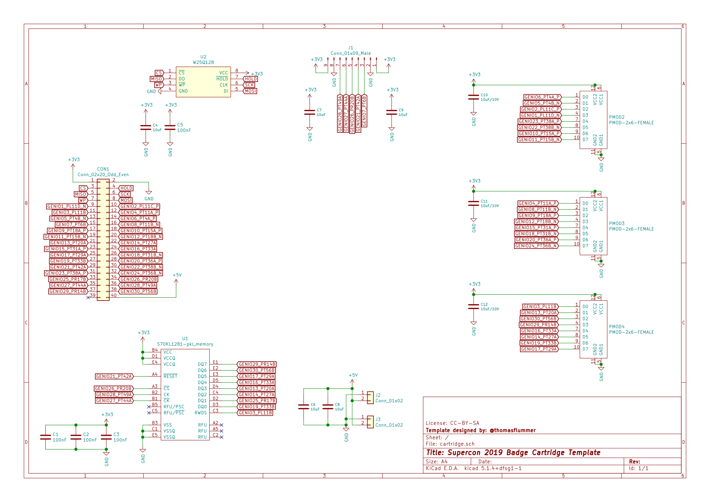
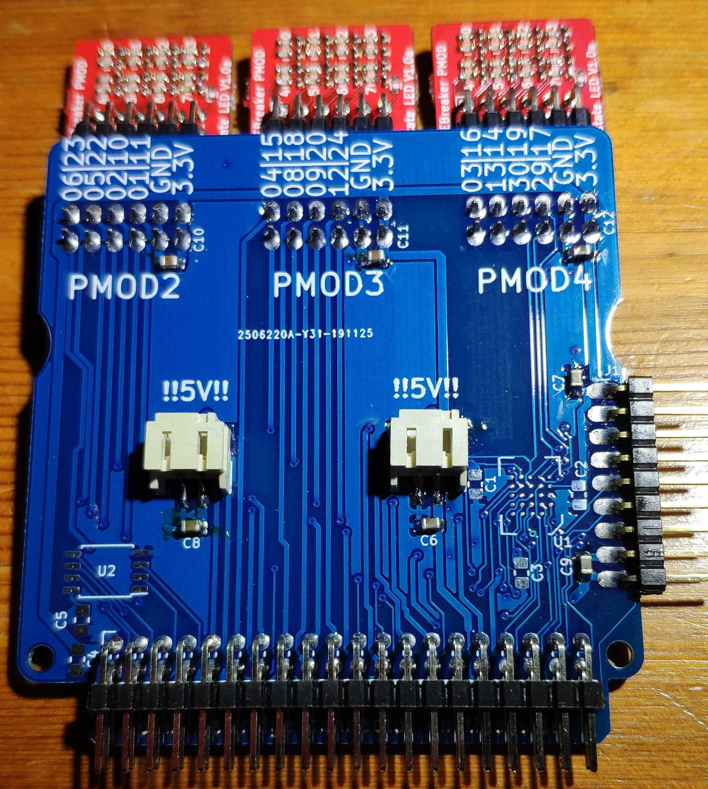

# PMOD<sup>3</sup> cartridge for 2019 supercon badge

Credit to [Thomas Flummer](https://github.com/flummer) for the cartridge template. Credit to [esden](https://github.com/icebreaker-fpga/icebreaker-pmod/tree/master/hyperram/v1.0b) and thus [bml](https://github.com/blackmesalabs/hyperram) for the Hyperram idea and schematic.

Rev 1.2 is back from JLC PCB and works well.

## Pin Mapping

The pin mapping was designed to keep differential pairs together.  I ran out of time to do the more complex pcb routing needed needed for differential pairs but this could be done in the future.

Here are some pin definitions that might work for litex/migen.  Note the clumsy but obvious switch from 1 base (silk) numbering to 0 base (fpga).
```
pmod_cubed = [
        ("pmod2", 0,
         Subsignal("p1", Pins("genio:{}".format(6-1))),
         Subsignal("p2", Pins("genio:{}".format(5-1))),
         Subsignal("p3", Pins("genio:{}".format(2-1))),
         Subsignal("p4", Pins("genio:{}".format(1-1))),
         Subsignal("p5", Pins("genio:{}".format(23-1))),
         Subsignal("p6", Pins("genio:{}".format(22-1))),
         Subsignal("p7", Pins("genio:{}".format(10-1))),
         Subsignal("p8", Pins("genio:{}".format(11-1))),
        ),
        ("pmod3", 1,
         Subsignal("p1", Pins("genio:{}".format(4-1))),
         Subsignal("p2", Pins("genio:{}".format(8-1))),
         Subsignal("p3", Pins("genio:{}".format(9-1))),
         Subsignal("p4", Pins("genio:{}".format(12-1))),
         Subsignal("p5", Pins("genio:{}".format(15-1))),
         Subsignal("p6", Pins("genio:{}".format(18-1))),
         Subsignal("p7", Pins("genio:{}".format(20-1))),
         Subsignal("p8", Pins("genio:{}".format(24-1))),
        ),
        ("pmod4", 2,
         Subsignal("p1", Pins("genio:{}".format(3-1))),
         Subsignal("p2", Pins("genio:{}".format(13-1))),
         Subsignal("p3", Pins("genio:{}".format(30-1))),
         Subsignal("p4", Pins("genio:{}".format(29-1))),
         Subsignal("p5", Pins("genio:{}".format(16-1))),
         Subsignal("p6", Pins("genio:{}".format(14-1))),
         Subsignal("p7", Pins("genio:{}".format(19-1))),
         Subsignal("p8", Pins("genio:{}".format(17-1))),
        ),
         ]
```

## Load options

### Minimal

This one is for most people, just load the connectors and C13-C15 and you're done.

### PMOD<sup>2</sup> with HYPERRAM

If you want to you can not load PMOD4 and add Hyperram.  It uses the same schematic as the [icebreaker pmod](https://github.com/icebreaker-fpga/icebreaker-pmod/tree/master/hyperram/v1.0b).  This option is untested YMMY.

## Errata

### v1.2
 * Take care to make sure the pmod pins don't make contact with the sao pins on the badge.  Installing the 5V JST connectors is a great way to do this.

### v1.0

 * DO NOT USE, 3.3V and GND are swapped on the badge connector
 * As above the local 3.3V supplies are useless since the 5V is not VUSB as expected
 * The pmod pin numbering on the silk is flipped by row, top is bottom and bottom is top
 * There are 5 io that are either NC or only connected to the Hyperram, need to add a header

## Schematic

### v1.2


### v1.0


## Images

### v1.2




