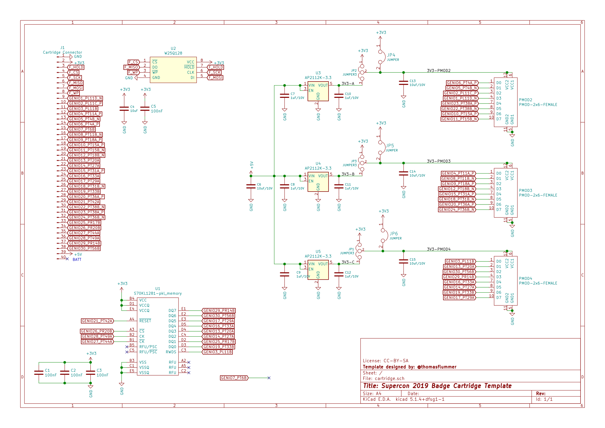

# PMOD3 cartridge for 2019 supercon badge

## Pin Mapping

The pin mapping was designed to keep differential pairs together.  I ran out of time to do the more complex pcb routing needed needed for differential pairs but this could be done in the future.

## Load options

### Minimal

This one is for most people, just load the connectors and C13-C15 and you're done.

### Minimal with optional local 3.3V support

This is pretty much useless.  It adds local 3.3V regulators for each pmod.  But the 5V is not VUSB, it's a boosted 5V from the battery.  Would be possible to cut a trace and inject 5V if needed using local boost from the battery or white wire vusb.  The 3.3V p/s in Minimal has at least 500mA available.

### PMOD2 with HYPERRAM

If you want to you can not load PMOD4 and add Hyperram.  It uses the same schematic as the [icebreaker pmod](https://github.com/icebreaker-fpga/icebreaker-pmod/tree/master/hyperram/v1.0b).  This option is untested YMMY.

## Schematic

## Image

