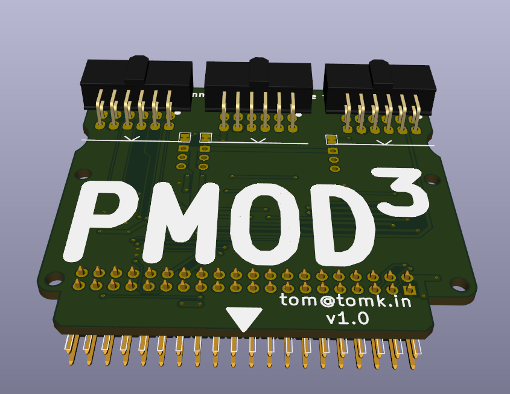

# PMOD<sup>3</sup> cartridge for 2019 supercon badge

## Pin Mapping

The pin mapping was designed to keep differential pairs together.  I ran out of time to do the more complex pcb routing needed needed for differential pairs but this could be done in the future.

Here are some pin definitions that might work for litex/migen.  Note the clumsy but obvious switch from 1 base (silk) numbering to 0 base (fpga).
```
pmod_cubed = [
        ("pmod2", 0,
         Subsignal("p1", Pins("genio:{}".format(-1+6))),
         Subsignal("p2", Pins("genio:{}".format(-1+5))),
         Subsignal("p3", Pins("genio:{}".format(-1+2))),
         Subsignal("p4", Pins("genio:{}".format(-1+1))),
         Subsignal("p5", Pins("genio:{}".format(-1+23))),
         Subsignal("p6", Pins("genio:{}".format(-1+22))),
         Subsignal("p7", Pins("genio:{}".format(-1+10))),
         Subsignal("p8", Pins("genio:{}".format(-1+11))),
        ),
        ("pmod3", 1,
         Subsignal("p1", Pins("genio:{}".format(-1+4))),
         Subsignal("p2", Pins("genio:{}".format(-1+8))),
         Subsignal("p3", Pins("genio:{}".format(-1+9))),
         Subsignal("p4", Pins("genio:{}".format(-1+12))),
         Subsignal("p5", Pins("genio:{}".format(-1+15))),
         Subsignal("p6", Pins("genio:{}".format(-1+18))),
         Subsignal("p7", Pins("genio:{}".format(-1+20))),
         Subsignal("p8", Pins("genio:{}".format(-1+24))),
        ),
        ("pmod4", 2,
         Subsignal("p1", Pins("genio:{}".format(-1+3))),
         Subsignal("p2", Pins("genio:{}".format(-1+13))),
         Subsignal("p3", Pins("genio:{}".format(-1+30))),
         Subsignal("p4", Pins("genio:{}".format(-1+29))),
         Subsignal("p5", Pins("genio:{}".format(-1+16))),
         Subsignal("p6", Pins("genio:{}".format(-1+14))),
         Subsignal("p7", Pins("genio:{}".format(-1+19))),
         Subsignal("p8", Pins("genio:{}".format(-1+17))),
        ),
         ]
```

## Load options

### Minimal

This one is for most people, just load the connectors and C13-C15 and you're done.

### Minimal with optional local 3.3V support

This is pretty much useless.  It adds local 3.3V regulators for each pmod.  But the 5V is not VUSB, it's a boosted 5V from the battery.  Would be possible to cut a trace and inject 5V if needed using local boost from the battery or white wire vusb.  The 3.3V p/s in Minimal has at least 500mA available.

### PMOD<sup>2</sup> with HYPERRAM

If you want to you can not load PMOD4 and add Hyperram.  It uses the same schematic as the [icebreaker pmod](https://github.com/icebreaker-fpga/icebreaker-pmod/tree/master/hyperram/v1.0b).  This option is untested YMMY.

## Schematic


## Image


